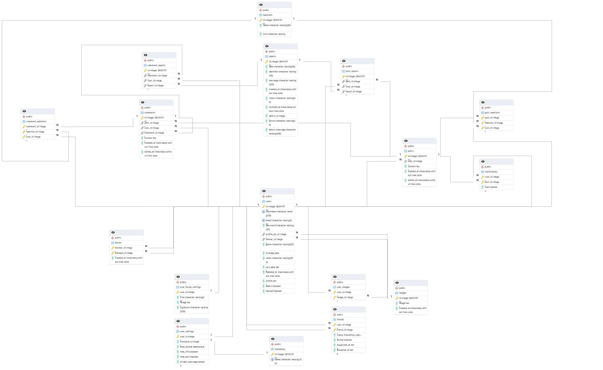

## Overview

“Fakelook” is a relational database designed for a simple social media platform. It allows users to:

* Create accounts with customizable profiles and bios

* Upload images

* Create posts and comment on others' content

* Add friends and receive notifications about their activity

* React to posts and comments

* Report inappropriate content to administrators for review

## ERP Diagram

## Database tables and Relationships

The database contains the following tables

- users - Contains users main properties, username, password, profile, profile picture, gender, etc

- user_setting - Stores user's setting like the timezone, dateformat, and some privacy setting like hide personal info and their posts

- images - Contains the user images 

- user_images - connects the images to the user

- friends - stores the user relations, info they are friends or if there an pending friend request as the muted friends (to prevent users from seeing posts from muted friends).

- blocks  - also stores relations between users but in this case it stores the users blocked by another user

- posts - contains the post content, and the user who made it as well as some metadata like the created date and edit date

- comments - are similar to posts but in also contains a reference to the post the comment is in and if it is a comment to another comment it references that comment as well

- reactions - contains the types of reactions and their icon

- post_reactions - stores the rections a users have made to a given post

- comment_reactions - similar to post_reactions but for comments

- notifications - contains the list of post friends that are not muted have made since they became friends

- reports - reports user have made to either comments or post,  with a description and a type of report

- post_reports - the post a report is referencing

- comment_reports - the comment a reports is referencing

## Relationships

 - users can have many images linked to their account and can add these image to either their profile picture or banner
 - users can have no images but images need to have a user
 - users can have 1 timezone and 1 dateformat 
 - users can have many friends and be friends of many friends
 - friends are mutual (this is handle in a procedure, although i could add a trigger)
 - users can block many users and be blocked by many users
 - users can post many posts but a post can only be made by one users, 
 - posts need to have a user
 - users can post many comments but a comment can only be made by one users, 
 - comments must to have a user when posted but if user is removed the comments remain (this is to prevent the mass deletion of comments to comments)
 - comments need 1 post but a post can have many comments
 - comments are removed if the post they belong to is removed
 - comments can be related to 1 comments but a comment can have many comments
 - users can add reactions to many posts/comments
 - users can add multiple different reaction types to a single comment/post, but may not repeat the same reaction type on that comment/post.
 - users can report many comments/posts and a post/comment can be reported by many users
 - users can report the same post/comment multiple times

## INDEX

Indexes were add to every foreign improve joins operations and filtering

Index were also added to profile_pic and banner_pic improve the performance on displaying user's profile, as well as user username and email to improve user search and login

Index in the date users became friends, posts and comments to sort from most recent to oldest and vice-versa

INDEX were also added to reports type and status to improve report filtering.

## trigger

Triggers were added to both comments and post so that on each update the edited timestamp is updated

It was also created a trigger to fill the notification table user mades a post, to notify their friends that haven't muted him 

NOTE: i trigger was added to when users is delete to remove their images however because of the way i structure foreign keys in "user_images" it doesn't work.
since user_images has if delete cascade for both "image_id" and "user_id", i can't have trigger AFTER DELETE because it's run after the ON DELETE CASCADE of "user_images" and so i lose the relations between the users and the images, and if I use BEFORE DELETE although ran before ON DELETE CASCADE, postgresql will sign the rows in "user_images" for deletion so when i try to delete the "images" is will cascade and will try to delete the rows on "user_images" again and throw an error (At least i thinks that's the case)

NOTE2: As i wrote this i notice i could use the after "AFTER DELETE" but instead of trying to delete the images of the user deleted, I could just delete the images that don't belong to any user

## Other random info/ Thoughts

I am aware that postgresql documentation and a lot of resourse online don't add "" to table, column, triggers, procedure, etc only strictly necessary, however the CS50SQL suggested adding them so I tried to do the way they wanted

The pgadmin when exporting diagram to image removes removes relations notations if you need to check the realations either open the pgerd file or check the diagram printscreen (although you won't be able to see the tables names)

To make testing the database easier I decided to make the query into procedure so that i could call them without having to rewrite them all the time.

I initially wanted comments and posts to have more distinct features, that's why i separated them into different tables. In order the avoid doing what i did WITH reactions where there is a table for comment's reactions and post'S reactions (which are basically the same)  i tried to use a single table for the reports of both comments and posts to allow for an easy query of both post and comment reports. However the structure I came up with proved to not be the easiest to work with.
Since i still keep comments and post reports in separated tables and then connect them to an overall reports tables queries got a bit confusing.
IT might have been better to have all reports in a single table with the indentifier column providing the information if the content id was from a post or a comment.

